<div align="center">



# Valence — the website

**The landing page for [Valence](https://github.com/Sudhss/Valence), a code editor built from scratch in C++17 and Qt 6.**

[](https://github.com/Sudhss/Valence-Website/actions/workflows/tests.yml)
&nbsp;[**Live site**](https://valence-website.vercel.app) · [Download V3](https://github.com/Sudhss/Valence/releases/download/v3.0/Valence_V3_Setup.exe) · [Editor source](https://github.com/Sudhss/Valence)

</div>

---

Most landing pages describe the product. This one **runs pieces of it**. The tokenizer, the undo manager, the judge's verdict rule and the editing behaviour are ported from Valence's C++ into JavaScript. The first three are tested against the output of the real C++, compiled and run on all 6,586 lines of Valence's own source; if one of them drifts, the badge above goes red.

## What's on the page

| Section | What you are looking at |
|---|---|
| **The name** | "Valence" drawn with 14,000 real characters of Valence's source, in its syntax colours. They part around your cursor. Scroll, and they fall back into their own lines. |
| **The canyon** | All 6,586 lines of `src/` as one glyph field of 197,032 characters in one draw call. You fly through it file by file; the status bar reports the real file and line under you. The lit band is the viewport, and it's the only part Valence paints. At the end the whole buffer folds into columns: 6,586 lines, 46 painted. |
| **text_buffer.cpp** | A working editor that follows Valence's rules: auto-closing pairs, smart indent, brace re-indent, the `cppmain` snippet, undo. Next to it, `std::vector<std::string>` in 3D: every character is a key, every line a row. Each edit shows exactly what the C++ would have moved. |
| **undo_manager.cpp** | The undo and redo stacks as two towers. Each slab is one undo group, labelled with its text. The page tells you why each new group started: the 400 ms limit, a word boundary, a jump elsewhere in the file. |
| **cpp_highlighter.cpp** | The tokenizer as a machine. A scan head crosses the line once, and each token's characters fly to the lane for their type. |
| **src/** | The 31 source files as towers on six layers; each tower's height is the file's line count. A glowing marker walks the calls one keystroke makes through the files. |
| **judge.cpp** | The judge panel replaying real runs of five solutions (AC, WA, TLE, RE, CE) at their recorded speed. |
| **bench.txt** | What one keystroke costs, before and after V3's incremental highlighting, against a 16.6 ms frame. |



## Nothing on it is made up

Every number and verdict on the site comes from something that actually ran.

- **The tokenizer, undo manager and judge comparator** are tested against golden output. `tools/golden/make_golden.py` compiles harnesses against Valence's real `cpp_highlighter.cpp`, `undo_manager.cpp` (with the clock swapped for one the test controls) and `judge.cpp` (linked with Qt 6). It runs them on every line of `src/` plus edge cases, and `npm test` requires the ports to match byte for byte.
- **The judge runs** are real. `tools/judge/record_runs.py` compiled each solution with the judge's own flags, piped every test case through it under the 3,000 ms limit, and recorded what happened. Your browser replays those recordings and works out each verdict itself with the ported `outputsMatch`. The TLE really does sit there for three seconds.



- **The benchmarks** are measured, and the page includes the size where the old approach dropped frames. The pre-V3 numbers come from the repository's `benchmark/benchmark.cpp`, re-run against the current source (`data/benchmark-2026-09-26.txt`). The V3 numbers come from `tools/bench/keystroke_v3.cpp`, which reproduces V3's incremental `rebuildCommentState` line for line on top of the real buffer and tokenizer (`data/keystroke-v3-2026-09-26.json`).



## How it's built

There's no framework and no build step, just static files. One WebGL context draws every 3D view: each view renders into its placeholder's rectangle of a single fixed canvas, using viewport and scissor, so the page never juggles five contexts.

```
index.html
css/site.css            the palette is theme.h's: elevation ramp, teal accent, syntax colours
js/
  core/                 ports of Valence's C++, tested against it
    lexer.js            cpp_highlighter.cpp
    buffer.js           text_buffer.cpp (and what each edit costs)
    undo.js             undo_manager.cpp
    judge.js            judge.cpp's comparison rule
    editing.js          editor_widget.cpp's editing behaviour
  gfx/                  one WebGL stage, a glyph atlas, instanced glyph and block layers
  views/                canyon (and the name), vector, undo stacks, tokenizer, architecture
  ui/                   editor surface, judge panel, benchmark chart, history, chrome
  data/                 generated: the source, the judge runs, the git history
tests/                  node:test suites + golden output from the real C++
tools/
  golden/               harnesses that compile Valence's C++ and record what it does
  judge/                the five solutions and the recorder
  bench/                the V3 keystroke benchmark
  readme/               generates the animated SVGs in this README
data/                   raw benchmark output
.github/workflows/      CI: ports vs golden, README animations up to date
```

## Run it

```bash
npm run serve          # http://localhost:5600
npm test               # ports vs the C++ golden output
```

The site uses ES modules, so serve it over HTTP; opening `index.html` directly from disk won't work. It deploys as a static site: on Vercel, import the repo with no build command and `/` as the output directory.

### Regenerating the data

These need the Valence repository as the parent folder and Qt 6 with MinGW. Paths default to the Qt installer's and can be overridden with `QT_DIR` and `MINGW_BIN`.

```bash
python tools/golden/make_golden.py     # source data + golden outputs
python tools/judge/record_runs.py      # compile and run the judge solutions
node tools/readme/make-svgs.mjs        # this README's animations
```

## Accessibility

- **Reduced motion:** with `prefers-reduced-motion`, the camera cuts instead of flying, springs settle instantly and the caret stops blinking.
- **No WebGL 2:** the page falls back to plain text, and every non-3D part keeps working.
- **Keyboard:** the editor takes Tab for indentation; Esc hands the keyboard back to the page.
- **Phones:** tapping download on a phone gets a verdict of its own.

---

<div align="center">
<sub>Built by <a href="https://github.com/Sudhss">Sudhanshu Shukla</a> · Valence is a native Windows app; this site is its brochure, with the engine exposed.</sub>
</div>
